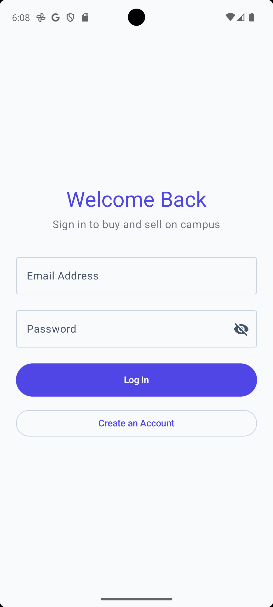
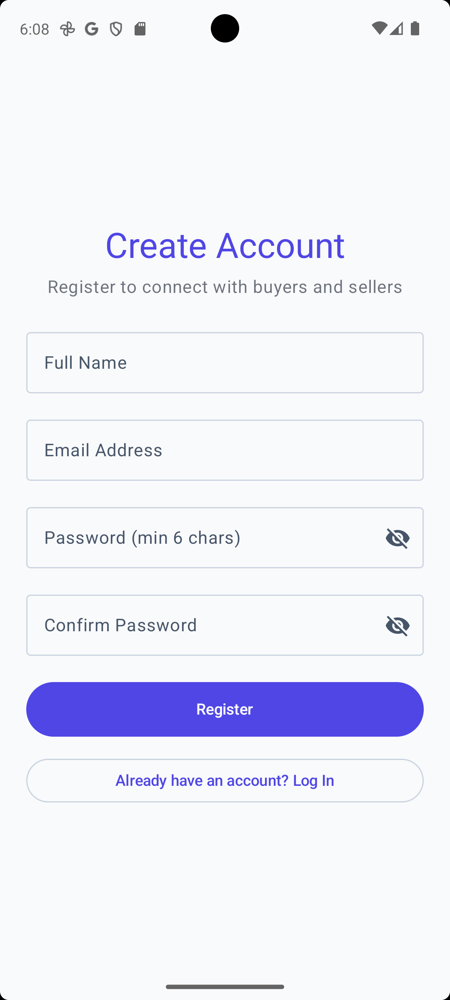

# 📱 CampusCart

> A modern Android marketplace application built for college students to buy and sell products securely within their campus.

CampusCart is a responsive and localized college marketplace application designed to facilitate peer-to-peer buying and selling. It provides students with a secure environment to trade items such as textbooks, electronics, and lab equipment directly with their peers within the campus boundaries.

---

[](https://kotlinlang.org/)
[](https://developer.android.com/jetpack/compose)
[](https://m3.material.io/)
[](#architecture)
[](https://firebase.google.com/)
[](https://firebase.google.com/docs/firestore)
[](https://cloudinary.com/)


---

## 🚀 Highlights

- **Built completely using Jetpack Compose**: Fully declarative and modern Android UI architecture.
- **MVVM Architecture**: Strict separation of concerns keeping UI, state business logic, and database persistence modular.
- **Firebase Authentication**: User registration and login flow management.
- **Cloud Firestore Backend**: NoSQL Firestore setup storing marketplace listings, user information, and user-favorite collections.
- **Cloudinary Image Uploads**: Cloud-hosted image storage and optimization.
- **Material 3 UI**: Up-to-date Material design patterns (e.g. Surface colors, chips, switches, top app bars, and responsive grids).
- **Responsive Android Interface**: Smooth animations, proper elevation handling, and elegant image clipping properties.

---

## ✨ Features

- **✅ User Authentication**: Secure user sign-up, login, and logout powered by Firebase Authentication.
- **✅ Home Marketplace**: A clean feed displaying active campus listings with high-quality visual grids.
- **✅ Product Search**: Real-time listing lookup based on keyword matches.
- **✅ Category Filtering**: Seamless grouping of products by categories (e.g., Books, Electronics, Clothing, etc.).
- **✅ Product Details**: Comprehensive view of individual item listings, including seller information, condition, negotiable status, and images.
- **✅ Sell Product**: Clean form allowing sellers to fill out title, description, price, location, condition, category, and negotiate toggle.
- **✅ Multiple Image Upload**: Select up to 5 photos per listing to showcase items in detail.
- **✅ Cloudinary Image Storage**: Hosted image uploads securely managed via Cloudinary CDN integration.
- **✅ Seller Dashboard**: A dedicated space for sellers to track active listings and view counts.
- **✅ Product Status Management**: Ability to update product statuses (e.g., Available, Sold) or soft-delete listings.
- **✅ Profile Management**: Profile tracking showcasing registered student information.
- **✅ Favorites**: Ability to bookmark interesting products with an instant toggle, persisting favorites list on the Firestore database and dedicated Favorites Screen.
- **✅ Firestore Database**: Low-latency, scalable document database storing app listings, user data, and favorite relations.
- **✅ Responsive Jetpack Compose UI**: Modern Material 3 look and feel with responsive UI structures and polished layouts.

---

## 🛠️ Tech Stack

| Layer | Technology |
|---|---|
| **Programming Language** | [Kotlin](https://kotlinlang.org/) |
| **UI Framework** | [Jetpack Compose](https://developer.android.com/compose) |
| **UI Design System** | [Material Design 3 Guidelines](https://m3.material.io/) |
| **Architectural Pattern** | MVVM (Model-View-ViewModel) |
| **Asynchronous Programming** | [Coroutines](https://kotlinlang.org/docs/coroutines-overview.html) & [StateFlow](https://kotlinlang.org/api/kotlinx.coroutines/kotlinx-coroutines-core/kotlinx.flow/-state-flow/) |
| **Backend & Cloud Database** | [Cloud Firestore](https://firebase.google.com/docs/firestore) |
| **Authentication Service** | [Firebase Authentication](https://firebase.google.com/docs/auth) |
| **Image Storage & CDN** | [Cloudinary Service](https://cloudinary.com/) |
| **Image Loading Library** | [Coil for Compose](https://coil-kt.github.io/coil/) |

---

## 📐 Architecture

CampusCart adheres to the **MVVM (Model-View-ViewModel)** architectural pattern combined with clean data-layer separation:

```
┌──────────────────────────────────────────────┐
│                  View (UI)                   │
│           (Jetpack Compose Screens)          │
└──────────────────────┬───────────────────────┘
                       ▼
┌──────────────────────────────────────────────┐
│                  ViewModel                   │
│         (Exposes UI state via Flow)          │
└──────────────────────┬───────────────────────┘
                       ▼
┌──────────────────────────────────────────────┐
│              Repository Layer                │
│       (AuthRepository / ProductRepository)   │
└──────────────────────┬───────────────────────┘
                       ▼
┌──────────────────────────────────────────────┐
│                 Data Sources                 │
│      (Cloud Firestore / Firebase Auth /      │
│               Cloudinary API)                │
└──────────────────────────────────────────────┘
```

- **Model**: Defines Firestore data classes (e.g., `Product`, `User`) stored under specific collections.
- **View**: Implemented as stateless/stateful Jetpack Compose screens that react to UI state flows.
- **ViewModel**: Manages UI state, handles user interaction logic, launches coroutine scopes for operations, and delegates data access to Repositories.
- **Repository**: Acts as the single source of truth for business logic and manages remote API / database interactions.

---

## 📂 Folder Structure

```
app/src/main/java/com/agrima/campuscart/
├── data/
│   ├── model/         # Product, User model definitions
│   └── repository/    # Repository interfaces and Firestore/Cloudinary implementations
├── di/                # DependencyContainer for manual DI wiring
├── ui/
│   ├── auth/          # Authentication ViewModels and states
│   ├── dashboard/     # Seller Dashboard ViewModels and states
│   ├── details/       # Product Details ViewModels and states
│   ├── favorites/     # Favorites Screen ViewModels and states
│   ├── home/          # Home Screen ViewModels and states
│   ├── navigation/    # App Navigation routes and NavHost controllers
│   ├── profile/       # Profile ViewModels and states
│   ├── screens/       # Jetpack Compose Screens (Home, Login, Dashboard, etc.)
│   ├── sell/          # Sell ViewModels and states
│   └── theme/         # Color palettes, typography, and shape design tokens
└── MainActivity.kt    # Root Android Activity entering the app navigation
```

---

## 📺 Screens

### Login/Signup Screen

[//]: # (📷 Screenshot Coming Soon)
<table>
<tr>
<td align="center">

**Login Screen**



</td>

<td align="center">

**Signup Screen**



</td>
</tr>
</table>

### Home Screen

📷 Screenshot Coming Soon

### Product Details Screen

📷 Screenshot Coming Soon

### Sell Screen

📷 Screenshot Coming Soon

### Dashboard Screen

📷 Screenshot Coming Soon

### Favorites Screen

📷 Screenshot Coming Soon

### Profile Screen

📷 Screenshot Coming Soon

---

## 🎥 Demo

Demo video coming soon.

---

## ⚙️ Installation

### Prerequisites
- Android Studio Ladybug (or higher)
- JDK 17
- Android SDK level 34

### Steps to Run
1. Clone this repository to your local machine:
   ```bash
   git clone https://github.com/agrimagoel30/CampusCart.git
   ```
2. Open the cloned folder in Android Studio.
3. Allow Gradle project synchronization to complete and download all dependencies.
4. Select your emulator or a physical target device.
5. Click the **Run** button (green play icon) or run:
   ```bash
   ./gradlew assembleDebug
   ```

---

## 🔐 Firebase Setup

CampusCart relies on Firebase services for databases and accounts:
- **Firebase Authentication**: You must enable **Email/Password** provider inside the Firebase console.
- **Cloud Firestore**: Setup collections named `products`, `users`, and user-scoped subcollections for favorites.
- Add your own `google-services.json` file inside the `app/` folder root to connect the application to your Firebase project.

---

## ☁️ Cloudinary Setup

Cloudinary is used for uploading product pictures:
- Configure your own Cloudinary Cloud Name and Upload Preset in the application container setup before running the application to facilitate successful image uploads.

---

## 🔮 Future Improvements

- **Chat System**: Integrated messaging allowing direct communication between buyer and seller.
- **Notifications**: Instant pushes notifying users of listing sales, favorites updates, and incoming messages.
- **Product Reporting**: Report system allowing users to flag inappropriate or prohibited items.
- **Dark Theme**: Support for Android System-wide dark mode interface.
- **Image Compression**: Client-side image pre-processing improvements to reduce size before Cloudinary uploads.

---

## 👤 Author

- **Name**: [Agrima Goel]
- **GitHub**: [@agrimagoel30](https://github.com/agrimagoel30)
